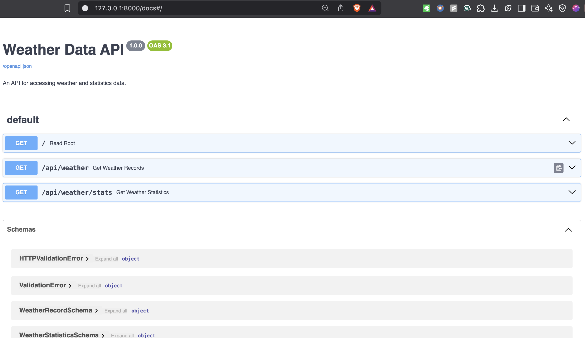
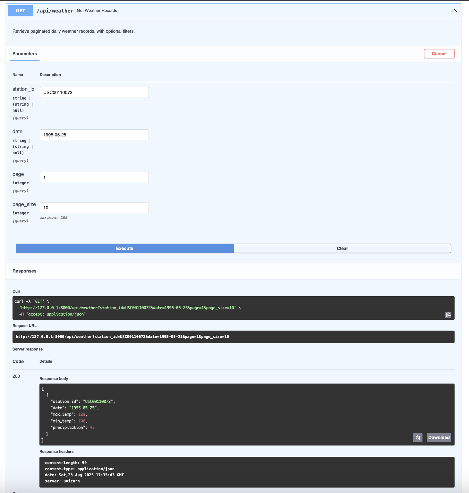
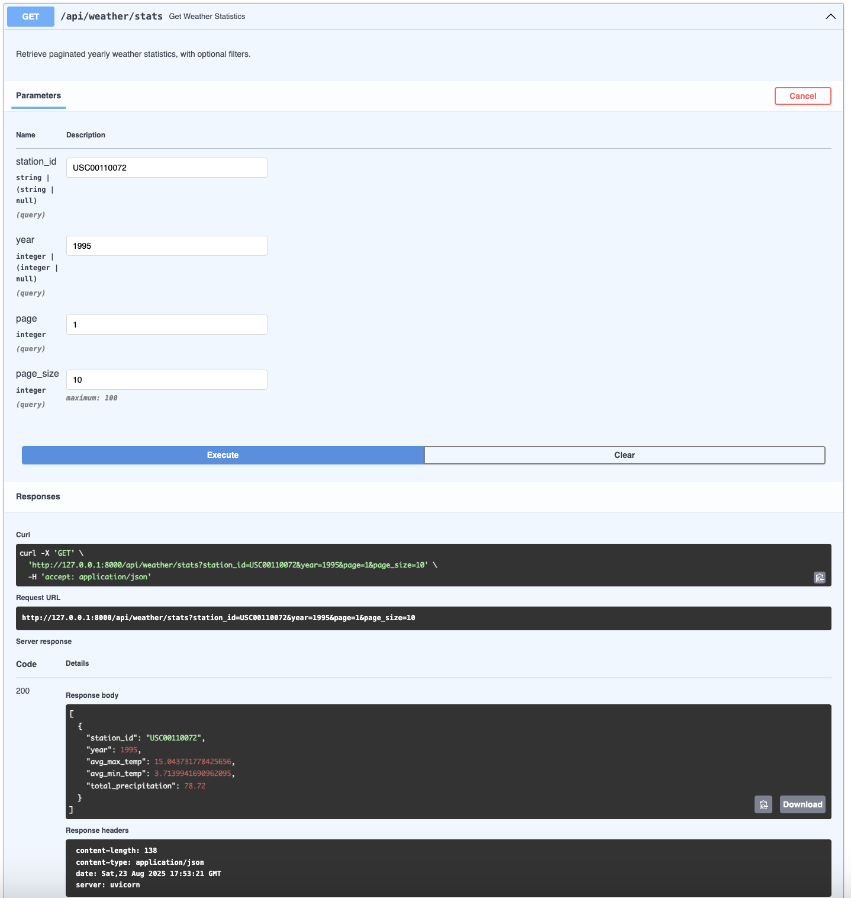
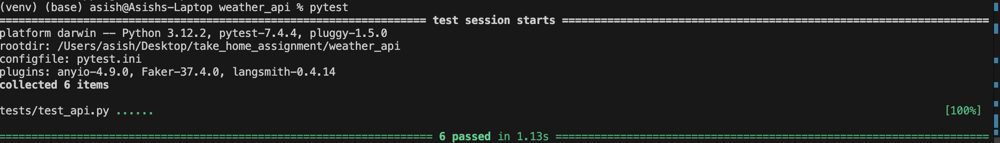

# Weather Data Engineering Project

## Overview
This project is a complete data engineering pipeline built as a solution to the Corteva Data Engineering coding exercise. The goal was to process raw weather data files, store them in a database, perform analysis, and expose the data via a RESTful API. This solution accomplishes all requirements, resulting in a well-structured, tested, and documented application.

---

## My Approach & Design Decisions
This project was built with a focus on creating a maintainable, robust, and professional-grade application. Here are the key design decisions I made:

### Technology Stack
I chose a modern Python stack for this project:

- **FastAPI**: Selected for its high performance, asynchronous capabilities, and, most importantly, its automatic generation of OpenAPI (Swagger UI) documentation, which was a core requirement.
- **SQLAlchemy**: Used as the ORM to interact with the database in a Pythonic way, providing a clear and maintainable way to define the schema and interact with data.
- **Pydantic**: Integrated with FastAPI, Pydantic was used to define strict data schemas for API responses, ensuring data consistency and powering the detailed documentation.
- **Pytest**: Chosen as the testing framework for its simplicity and power, allowing for clear and effective unit tests of the API endpoints.

### Project Structure
I organized the project into a modular app package with a separate tests directory. This separates concerns, making the codebase cleaner and easier to navigate and maintain compared to a flat structure. Configuration was centralized in `app/config.py` to avoid hardcoding values in multiple places.

### Data Ingestion (`ingest.py`)
The ingestion script was designed to be both efficient and idempotent.

- **Efficiency**: Instead of committing one record at a time, data from each file is read into a list and inserted using SQLAlchemy's `bulk_save_objects` method. This significantly reduces the number of database transactions.
- **Idempotency**: The script can be run multiple times without creating duplicate data. This is achieved by leveraging the `UniqueConstraint` on the database table and catching the `IntegrityError`, which allows the script to gracefully skip files that have already been processed.

### Data Analysis (`stats.py`)
For performance, the statistical calculations are offloaded directly to the database engine. A single, comprehensive SQL query is used to calculate the yearly averages and totals for all stations at once. The results are inserted or updated using an `INSERT ... ON CONFLICT` (upsert) command, ensuring this script is also idempotent.

### API Design (`api.py`)
The API uses FastAPI's dependency injection system (`Depends(get_db)`) to manage database sessions, ensuring that each request gets its own session that is properly closed afterward. This is a robust pattern for handling database connections in a web application. The endpoints for filtering and pagination are implemented by dynamically building SQLAlchemy queries based on optional function parameters.

---

## Features & Functionality
The final application is fully functional and meets all specified requirements.

### Interactive API Documentation
The API includes automatically generated documentation, allowing for easy exploration and testing of the endpoints directly in the browser.

### Live API Endpoints
The API serves both raw and analyzed data, with support for filtering and pagination.

An example query and successful JSON response for the `/api/weather` endpoint:

An example query and successful JSON response for the `/api/weather/stats` endpoint:

---

## Setup and Installation

1.  Clone the repository:

    git clone https://github.com/Asish107/weather-api-project.git
    cd weather-api-project
    

2.  Create and activate a Python virtual environment:
    python -m venv venv
    source venv/bin/activate  
  

3.  Install dependencies:
    pip install -r requirements.txt

---

## Usage

Run the following commands from the root `weather_api` directory.

1.  Ingest the Data: This will populate the `weather.db` database with the raw weather records.
    python app/ingest.py
    

2.  Calculate Statistics: This will calculate the yearly statistics and save them to a new table in the database.
    python app/stats.py

3.  Run the API Server: This will start the live API server.
    uvicorn app.api:app --reload
    
    You can now access the interactive documentation at [http://127.0.0.1:8000/docs](http://127.0.0.1:8000/docs).

---

## Testing

To run the automated test suite, execute the following command from the root `weather_api` directory. Pytest will automatically discover and run all tests in the `tests/` directory.

pytest

Successful test run confirming all API functionality works as expected.

---

## Deployment on AWS
Deployment on AWS
If I were to deploy this project to a production environment on AWS, I would adopt the following architecture to ensure it is scalable, secure, and maintainable.

1. Database
I would migrate the SQLite database to Amazon RDS for PostgreSQL. As a managed service, RDS would handle backups, patching, and scaling, which provides high availability and durability for our data.

2. Data Ingestion
I would re-architect the ingestion process to be serverless and event-driven. The raw wx_data files would be stored in an Amazon S3 bucket. An AWS Lambda function containing the ingestion logic would be triggered on a schedule by Amazon EventBridge, processing new files as they arrive. This is highly cost-efficient as we'd only pay for compute time when data is actively being ingested.

3. API Deployment
The FastAPI application would be containerized using Docker for portability. I would store the container image in Amazon ECR and deploy it using a serverless compute service like AWS Fargate or AWS App Runner. This would allow the API to scale automatically based on traffic without the need to manage servers. To secure and manage the API, I would place an Amazon API Gateway in front of it to handle features like request throttling, API keys, and monitoring.

Data Source - 
The weather data and the original coding challenge prompt were provided by the Corteva Agriscience code challenge template, available at https://github.com/corteva/code-challenge-template.
